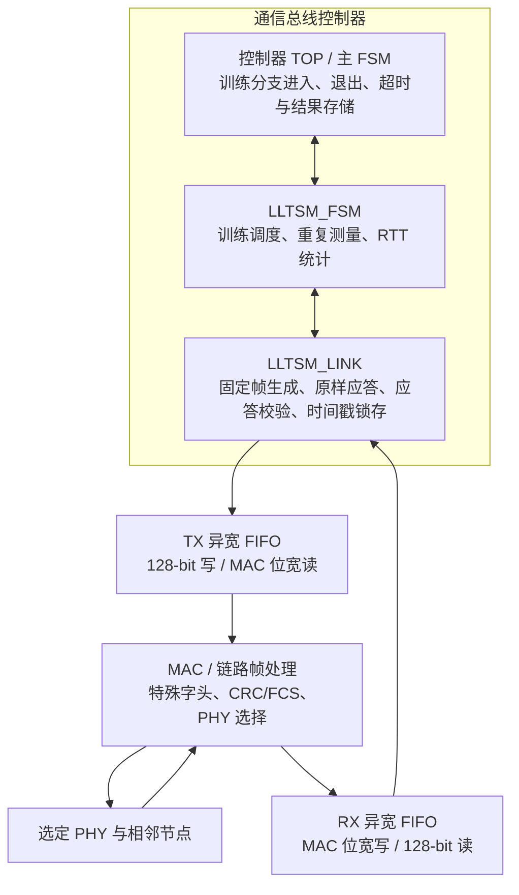

# LLTSM 架构与接口

## 总体结构

LLTSM 的架构层只有 `lltsm_fsm` 和 `lltsm_link`。异宽 FIFO 是控制器基础设施，
MAC 是现有链路层，两者都不算 LLTSM 的额外收发适配模块。

## LLTSM_FSM 职责

- 接受 TOP 的 `branch_enable/start/abort`；
- 调度 LINK 发送本地训练请求或远端请求的原样应答；
- 记录 TX FIFO 接受请求时的本地参考时间；
- 接受 LINK 校验后的应答时间戳并计算 RTT；
- 重复测量并输出平均 RTT 与补偿后的均值时延；
- 通过 `branch_done` 请求 TOP 完成本次分支跳转。

FSM 不解析帧、不操作 CRC、不直接选择 PHY，也不决定通信控制器主 FSM 的状态。

## LLTSM_LINK 职责

- 根据稳定配置和序号构造固定 128-bit `TRAIN_FRAME`；
- 一次写入 TX FIFO 的宽写口；
- 保存本地已发送负载，供应答逐位比较；
- 接收 MAC/FIFO 回传记录并检查训练帧类别、CRC 状态、固定负载字段；
- 在请求端要求应答与本次发送负载 128-bit 完全一致；
- 在应答端锁存请求并按 FSM 命令原样写回；
- 通过校验后锁存 `rx_fifo_timestamp` 并上送 FSM。

LINK 不生成链路字头或 CRC；`tx_fifo_train_frame` 只是告诉 MAC 应选择哪一种固定
链路帧类别。

## 控制接口

| 方向 | 主要信号 |
|---|---|
| TOP -> FSM | `branch_enable`, `branch_start`, `branch_abort`, `time_now` |
| FSM -> TOP | `branch_start_ready`, `branch_busy`, `branch_done`, `result_*` |
| FSM -> LINK | `link_clear`, `link_tx_request_valid`, `link_tx_echo_valid`, `link_expect_response`, `link_training_sequence` |
| LINK -> FSM | 对应 `ready`、`rx_request_valid`、`rx_response_valid`、锁存时间戳 |

## 配置接口

TOP 直接向 LINK 提供并在训练分支期间保持稳定：

- `local_node_id[7:0]`
- `neighbor_node_id[7:0]`
- `selected_link_id[7:0]`
- `selected_channel_id`
- `training_round_id[7:0]`

序号由 FSM 的 `link_training_sequence[7:0]` 提供。

## 状态摘要

| 状态 | 行为 | 跳转 |
|---|---|---|
| `S_IDLE` | 等待 TOP 本地启动或远端有效请求 | 请求优先；进入发送请求或应答等待 |
| `S_SEND_REQUEST` | 请求 LINK 写入固定训练帧 | FIFO 接受后记录 TX 时间并等待应答 |
| `S_WAIT_RESPONSE` | 等待 LINK 的精确应答匹配 | 累加 RTT，重复或完成 |
| `S_RESPONSE_WAIT` | 固定应答等待 | 计数结束后发送原样应答 |
| `S_SEND_ECHO` | 命令 LINK 写回锁存负载 | FIFO 接受后返回空闲 |
| `S_DONE` | 输出一周期结果与完成脉冲 | 下一周期返回空闲；TOP 同步跳出分支 |

## 参考点

- TX 参考点：完整 128-bit 训练负载被 TX FIFO 宽写口接受；
- RX 参考点：MAC 提供并与 RX FIFO 完整记录对齐的 `rx_fifo_timestamp`。

这两个参考点必须在训练和后续补偿中保持同一定义。若需要纯 PHY 传播时延，时间戳
必须进一步下沉到 MAC/PHY 边界，当前控制器侧参考点不能被误称为纯线缆时延。
