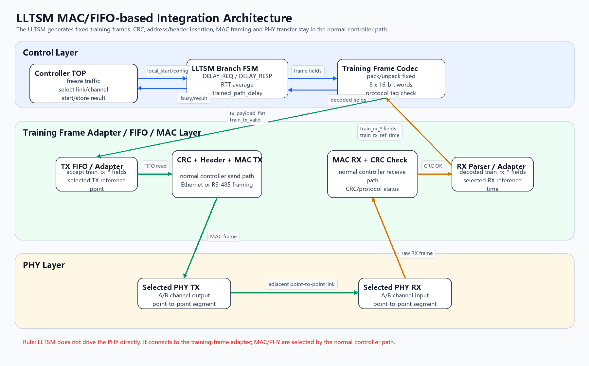
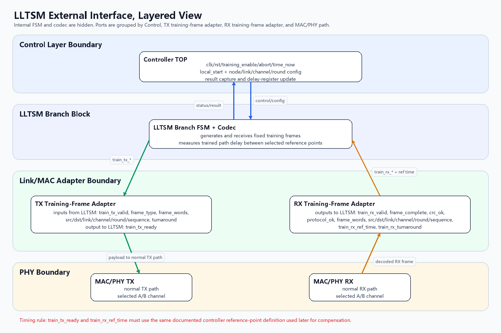
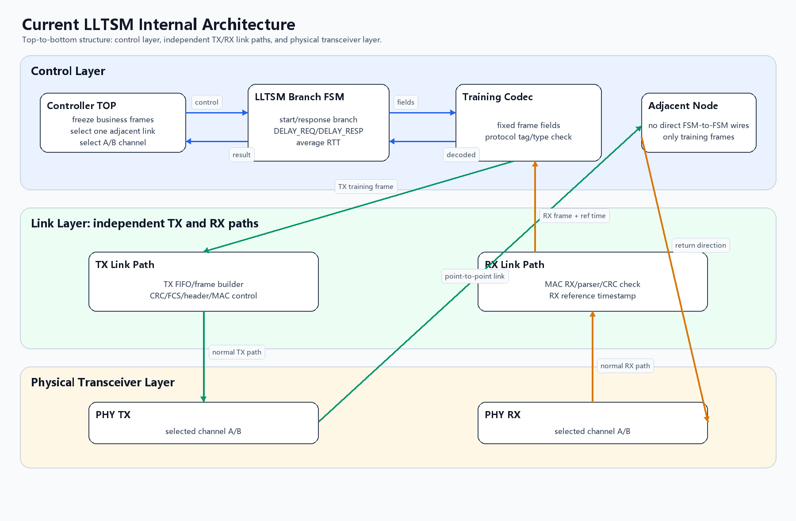
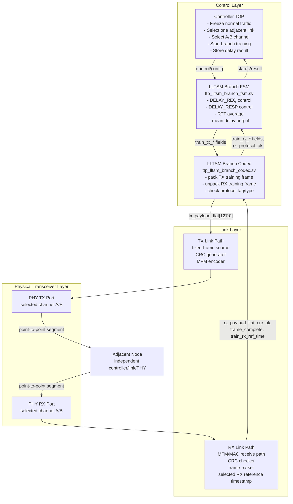
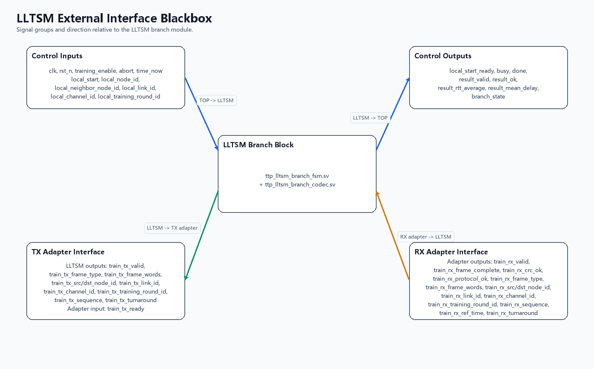
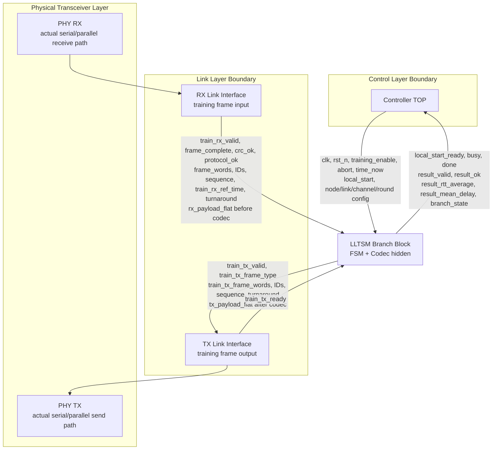
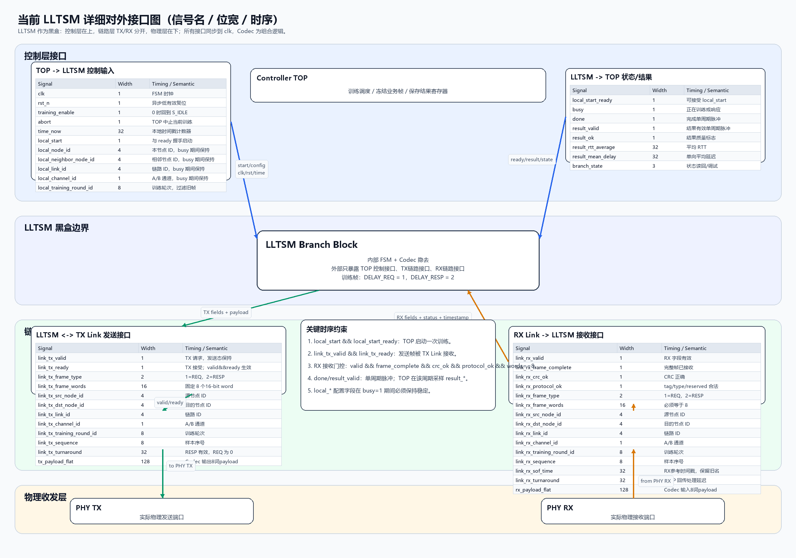

# Current LLTSM Internal Architecture and External Interface

Generated: 2026-07-07  
Active RTL:

- `ttp_lltsm_branch_fsm.sv`
- `ttp_lltsm_branch_codec.sv`

Frozen delay-definition note:

- See `LLTSM_Trained_Path_Delay_Frozen_Scheme.md`.
- The current project measures `trained_path_delay`, not pure `physical_link_delay`.
- Current RTL uses `train_tx_*`, `train_rx_*`, and `train_rx_ref_time` to make the controller training-frame adapter boundary explicit.

## 0. Frozen Integration Position: FIFO/MAC/PHY Boundary and Timestamp Reference

The LLTSM branch must not be treated as a direct PHY-driving module. In the controller integration, LLTSM training data should enter the same controller-side buffering and frame processing path as normal traffic. The controller link layer or frame builder then adds the required bus header, address/type fields, CRC/FCS policy, and MAC control before the frame is sent by the selected MAC and PHY.

Recommended integration boundary:

- LLTSM boundary: generate and recognize fixed-length training frames, including training frame type, node/link/channel IDs, sequence, turnaround, and fixed payload.
- Controller link/FIFO boundary: buffer training frames and normal frames; arbitrate traffic during training; parse or build controller-level frame metadata.
- MAC boundary: apply the actual medium frame format, such as Ethernet MAC frame handling or RS-485 frame handling.
- PHY boundary: perform actual electrical, optical, or differential physical transmission.

Frozen timestamp policy:

The current implementation measures trained path delay, not pure physical link propagation delay. The selected timestamp reference point may be placed at the controller TX FIFO/frame-adapter boundary and the controller RX parser boundary. This is acceptable because normal traffic is frozen during training, so FIFO queueing is constrained to a deterministic or negligible value, and later synchronization compensation uses the same reference-point definition.

Definition used for the current project:

```text
trained_path_delay =
    controller TX reference point
  + fixed controller TX path
  + MAC/PHY fixed path
  + physical link propagation
  + fixed controller RX path
  - responder turnaround compensation
```

Therefore the result should be documented and stored as `trained_path_delay` or `controller_to_controller_delay`, not as pure `physical_link_delay`.





## 1. Layered Internal Architecture

The current LLTSM is a resource-minimized, TOP-controlled branch FSM. It is not a self-scheduling distributed training protocol. The controller TOP freezes normal traffic, selects exactly one adjacent link and one A/B channel, then starts one local trained-path-delay measurement branch.





Key rule: local and adjacent state machines do not directly interact. They only exchange fixed-format training frames through the existing link transmit and receive paths.

## 2. External Interface Diagram





This diagram treats the LLTSM as one black-box module. The internal FSM/codec split is hidden; only the interfaces that must be wired to TOP and the local link layer are shown.

## 3. Detailed Interface Specification

Unless otherwise stated, all FSM-side signals are synchronous to `clk`. The FSM uses an active-low asynchronous reset `rst_n`. The codec is purely combinational.



Default parameter values used by the current project:

| Parameter | Default | Derived effect |
|---|---:|---|
| `NODE_COUNT` | 10 | `NODE_ID_WIDTH = 4` |
| `CHANNEL_COUNT` | 2 | `CHANNEL_ID_WIDTH = 1` |
| `LINK_COUNT` | 9 | `LINK_ID_WIDTH = 4` |
| `TIME_WIDTH` | 32 | Timestamp and turnaround width in FSM |
| `DELAY_WIDTH` | 32 | Result delay width |
| `MEASURE_REPEATS` | 4 | Four request/response samples are averaged |
| `RESPONSE_WAIT` | 32 | Response side waits 32 clocks after accepting a request |
| `TRAIN_FRAME_WORDS` | 8 | Training payload length is 8 x 16-bit words |

Integration constraint: the current codec uses a fixed 32-bit `tx_turnaround/rx_turnaround` field. Therefore the integrated frozen configuration should keep `TIME_WIDTH = DELAY_WIDTH = 32`.

### 3.1 Control Layer Inputs: TOP to LLTSM

| Signal | Direction | Width | Active timing | Semantic |
|---|---|---:|---|---|
| `clk` | input | 1 | continuous | LLTSM branch FSM clock. |
| `rst_n` | input | 1 | asynchronous, active low | Resets FSM to `S_IDLE`, clears counters, result flags, and response latches. |
| `training_enable` | input | 1 | sampled each `clk` | Enables training. If `0`, FSM returns to `S_IDLE` and clears active sample accumulation. |
| `abort` | input | 1 | sampled each `clk` | TOP-controlled cancel. If `1`, FSM returns to `S_IDLE`. |
| `time_now` | input | `TIME_WIDTH`, default 32 | sampled on TX fire and accepted RX events | Local timestamp counter. Used for RTT and turnaround arithmetic. |
| `local_start` | input | 1 | sampled in `S_IDLE` when `local_start_ready=1` | TOP requests this node to actively start one adjacent-link measurement. |
| `local_node_id` | input | `NODE_ID_WIDTH`, default 4 | must stay stable while `busy=1` | This node ID. Used as TX source and RX destination match. |
| `local_neighbor_node_id` | input | `NODE_ID_WIDTH`, default 4 | must stay stable while `busy=1` | Expected adjacent node ID. Used as TX destination and RX source match. |
| `local_link_id` | input | `LINK_ID_WIDTH`, default 4 | must stay stable while `busy=1` | Selected adjacent link ID. |
| `local_channel_id` | input | `CHANNEL_ID_WIDTH`, default 1 | must stay stable while `busy=1` | Selected redundant channel. `0/1` correspond to A/B by system convention. |
| `local_training_round_id` | input | 8 | must stay stable while `busy=1` | Training round/session ID. Rejects stale frames from previous training attempts. |

Control-layer start timing:

- `local_start_ready = 1` means the FSM can accept `local_start`.
- A start is accepted on a rising clock edge when `local_start && local_start_ready` is true.
- After acceptance, the FSM enters `S_SEND_REQ`.
- TOP must hold `local_node_id`, `local_neighbor_node_id`, `local_link_id`, `local_channel_id`, and `local_training_round_id` stable until `done=1` or the branch is aborted.
- If an adjacent valid `DELAY_REQ` arrives while idle, the FSM gives the received request priority and deasserts `local_start_ready`; TOP may retry `local_start` later.

### 3.2 Control Layer Outputs: LLTSM to TOP

| Signal | Direction | Width | Active timing | Semantic |
|---|---|---:|---|---|
| `local_start_ready` | output | 1 | combinational status | FSM is idle, training is enabled, and no adjacent request is being accepted in the current cycle. |
| `busy` | output | 1 | combinational status | `1` in `S_SEND_REQ`, `S_WAIT_RESP`, `S_RESPONSE_WAIT`, or `S_SEND_RESP`. |
| `done` | output | 1 | one clock pulse | Asserted in `S_DONE`. Indicates one local measurement branch has finished. |
| `result_valid` | output | 1 | one clock pulse, same cycle as `done` | Result outputs are valid in this cycle. |
| `result_ok` | output | 1 | valid when `result_valid=1` | `1` when averaged RTT is greater than remote turnaround. |
| `result_rtt_average` | output | `DELAY_WIDTH`, default 32 | valid when `result_valid=1` | Average RTT over `MEASURE_REPEATS` samples. |
| `result_mean_delay` | output | `DELAY_WIDTH`, default 32 | valid when `result_valid=1` | One-way mean delay: `(average RTT - remote turnaround) >> 1`; saturated to zero if invalid. |
| `branch_state` | output | 3 | continuous debug/status | Current FSM state encoding: `0=IDLE`, `1=SEND_REQ`, `2=WAIT_RESP`, `3=RESPONSE_WAIT`, `4=SEND_RESP`, `5=DONE`. |

Result timing:

- `done` and `result_valid` are asserted for exactly one `clk` cycle.
- TOP should capture `result_ok`, `result_rtt_average`, and `result_mean_delay` when `result_valid=1`.
- After `S_DONE`, FSM returns to `S_IDLE` on the next rising clock edge.

### 3.3 TX Link Interface: LLTSM to Local Link TX Path

| Signal | Direction | Width | Active timing | Semantic |
|---|---|---:|---|---|
| `train_tx_valid` | output | 1 | asserted in `S_SEND_REQ` or `S_SEND_RESP` | LLTSM requests transmission of one fixed training frame. |
| `train_tx_ready` | input | 1 | sampled with `train_tx_valid` | Local TX path accepts the frame when `train_tx_valid && train_tx_ready`. |
| `train_tx_frame_type` | output | 2 | valid when `train_tx_valid=1` | `1=DELAY_REQ`, `2=DELAY_RESP`. |
| `train_tx_frame_words` | output | 16 | valid when `train_tx_valid=1` | Payload length in 16-bit words. Current fixed value: `TRAIN_FRAME_WORDS=8`. |
| `train_tx_src_node_id` | output | `NODE_ID_WIDTH`, default 4 | valid when `train_tx_valid=1` | Source node ID. Normally `local_node_id`. |
| `train_tx_dst_node_id` | output | `NODE_ID_WIDTH`, default 4 | valid when `train_tx_valid=1` | Destination node ID. For response, this is the original requester. |
| `train_tx_link_id` | output | `LINK_ID_WIDTH`, default 4 | valid when `train_tx_valid=1` | Selected link ID. |
| `train_tx_channel_id` | output | `CHANNEL_ID_WIDTH`, default 1 | valid when `train_tx_valid=1` | Selected A/B channel ID. |
| `train_tx_training_round_id` | output | 8 | valid when `train_tx_valid=1` | Training round/session ID. |
| `train_tx_sequence` | output | 8 | valid when `train_tx_valid=1` | Sample sequence number. Request and response use the same sequence. |
| `train_tx_turnaround` | output | `TIME_WIDTH`, default 32 | valid for `DELAY_RESP`; zero for `DELAY_REQ` | Response-side elapsed time from request RX reference point to response TX reference point. |

TX timing:

- `train_tx_valid` remains asserted while the FSM is in a send state.
- A TX frame is consumed on the rising clock edge where `train_tx_valid && train_tx_ready` is true.
- For `DELAY_REQ`, the FSM latches `request_tx_ref_time <= time_now` on the accepted TX reference handshake and enters `S_WAIT_RESP`. In the frozen integration this reference may be the TX FIFO/frame-adapter acceptance point, not a physical MAC/PHY SOF.
- For `DELAY_RESP`, the FSM returns to `S_IDLE` after the accepted TX handshake.
- The TX link path should treat all `train_tx_*` fields as stable while `train_tx_valid=1`.

### 3.4 RX Link Interface: Local Link RX Path to LLTSM

| Signal | Direction | Width | Active timing | Semantic |
|---|---|---:|---|---|
| `train_rx_valid` | input | 1 | sampled by FSM | RX decoded fields are valid. |
| `train_rx_frame_complete` | input | 1 | sampled with `train_rx_valid` | Full fixed-length training frame has been received. |
| `train_rx_crc_ok` | input | 1 | sampled with `train_rx_valid` | Received frame passed CRC. |
| `train_rx_protocol_ok` | input | 1 | sampled with `train_rx_valid` | Codec reports correct training tag, legal type, and reserved fields. |
| `train_rx_frame_type` | input | 2 | valid when `train_rx_valid=1` | `1=DELAY_REQ`, `2=DELAY_RESP`. |
| `train_rx_frame_words` | input | 16 | valid when `train_rx_valid=1` | Received payload word count; must equal `TRAIN_FRAME_WORDS`. |
| `train_rx_src_node_id` | input | `NODE_ID_WIDTH`, default 4 | valid when `train_rx_valid=1` | Received source node ID. |
| `train_rx_dst_node_id` | input | `NODE_ID_WIDTH`, default 4 | valid when `train_rx_valid=1` | Received destination node ID. |
| `train_rx_link_id` | input | `LINK_ID_WIDTH`, default 4 | valid when `train_rx_valid=1` | Received link ID. |
| `train_rx_channel_id` | input | `CHANNEL_ID_WIDTH`, default 1 | valid when `train_rx_valid=1` | Received A/B channel ID. |
| `train_rx_training_round_id` | input | 8 | valid when `train_rx_valid=1` | Received training round/session ID. |
| `train_rx_sequence` | input | 8 | valid when `train_rx_valid=1` | Received sample sequence. Must match the expected sample on response reception. |
| `train_rx_ref_time` | input | `TIME_WIDTH`, default 32 | valid when `train_rx_valid=1` | Selected RX reference timestamp at the documented controller RX parser/FIFO boundary. |
| `train_rx_turnaround` | input | `TIME_WIDTH`, default 32 | valid for `DELAY_RESP` | Remote response-side turnaround field. |

RX acceptance timing:

The FSM accepts an inbound training frame only when all structural checks are true in the same cycle:

```verilog
train_rx_valid &&
train_rx_frame_complete &&
train_rx_crc_ok &&
train_rx_protocol_ok &&
(train_rx_frame_words == TRAIN_FRAME_WORDS)
```

Then the FSM applies semantic matching:

- For `DELAY_REQ`: frame type must be `1`, source must equal `local_neighbor_node_id`, destination must equal `local_node_id`, and link/channel/round must match local configuration.
- For `DELAY_RESP`: frame type must be `2`, source must equal `local_neighbor_node_id`, destination must equal `local_node_id`, link/channel/round must match, and `train_rx_sequence == sample_count`.
- Accepted RX fields are consumed on the rising clock edge in the active state.
- The RX path should keep all `train_rx_*` fields stable for the cycle where `train_rx_valid=1`.

### 3.5 Codec Boundary Signals

The codec is combinational. It may be placed between the FSM metadata interface and the existing 8-word fixed-frame payload interface.

| Signal | Direction | Width | Timing | Semantic |
|---|---|---:|---|---|
| `tx_frame_type` | input | 2 | combinational | Training type from FSM. |
| `tx_src_node_id` | input | `NODE_ID_WIDTH`, default 4 | combinational | Source node ID to pack. |
| `tx_dst_node_id` | input | `NODE_ID_WIDTH`, default 4 | combinational | Destination node ID to pack. |
| `tx_link_id` | input | `LINK_ID_WIDTH`, default 4 | combinational | Link ID to pack. |
| `tx_channel_id` | input | `CHANNEL_ID_WIDTH`, default 1 | combinational | Channel ID to pack. |
| `tx_training_round_id` | input | 8 | combinational | Training round to pack. |
| `tx_sequence` | input | 8 | combinational | Sequence to pack. |
| `tx_turnaround` | input | 32 | combinational | Turnaround field to pack for `DELAY_RESP`. |
| `tx_payload_flat` | output | 128 | combinational | Packed 8 x 16-bit training payload for CRC/MFM envelope. |
| `rx_payload_flat` | input | 128 | combinational | Received 8 x 16-bit training payload. |
| `rx_protocol_ok` | output | 1 | combinational | `1` only when protocol tag, frame type, and reserved bits are legal. |
| `rx_frame_type` | output | 2 | combinational | Decoded frame type. |
| `rx_src_node_id` | output | `NODE_ID_WIDTH`, default 4 | combinational | Decoded source node ID. |
| `rx_dst_node_id` | output | `NODE_ID_WIDTH`, default 4 | combinational | Decoded destination node ID. |
| `rx_link_id` | output | `LINK_ID_WIDTH`, default 4 | combinational | Decoded link ID. |
| `rx_channel_id` | output | `CHANNEL_ID_WIDTH`, default 1 | combinational | Decoded channel ID. |
| `rx_training_round_id` | output | 8 | combinational | Decoded training round ID. |
| `rx_sequence` | output | 8 | combinational | Decoded sequence. |
| `rx_turnaround` | output | 32 | combinational | Decoded turnaround for `DELAY_RESP`; zero for request frames. |

## 4. Top-Down External Interface Groups

### 4.1 Control Layer Interface: Controller TOP to LLTSM

| Direction | Signal | Meaning |
|---|---|---|
| TOP -> LLTSM | `clk` | LLTSM working clock. |
| TOP -> LLTSM | `rst_n` | Active-low reset. |
| TOP -> LLTSM | `training_enable` | Enables link training. If low, LLTSM returns to idle. |
| TOP -> LLTSM | `abort` | Cancels current branch training. |
| TOP -> LLTSM | `time_now` | Local time counter used for TX/RX timestamp arithmetic. |
| TOP -> LLTSM | `local_start` | Starts this node as the request side for the selected adjacent link. |
| TOP -> LLTSM | `local_node_id` | This node ID. |
| TOP -> LLTSM | `local_neighbor_node_id` | Adjacent node ID for the selected link. |
| TOP -> LLTSM | `local_link_id` | Selected link index. |
| TOP -> LLTSM | `local_channel_id` | Selected A/B channel. |
| TOP -> LLTSM | `local_training_round_id` | Training round ID used to reject stale frames. |

### 4.2 Control Layer Interface: LLTSM to Controller TOP

| Direction | Signal | Meaning |
|---|---|---|
| LLTSM -> TOP | `local_start_ready` | LLTSM can accept `local_start`. |
| LLTSM -> TOP | `busy` | LLTSM is currently training or responding. |
| LLTSM -> TOP | `done` | One-cycle completion pulse. |
| LLTSM -> TOP | `result_valid` | One-cycle result-valid pulse. |
| LLTSM -> TOP | `result_ok` | Result validity flag. |
| LLTSM -> TOP | `result_rtt_average` | Average measured round-trip time. |
| LLTSM -> TOP | `result_mean_delay` | Calculated one-way mean trained-path delay. |
| LLTSM -> TOP | `branch_state` | Debug/status state encoding. |

### 4.3 TX Link Interface: LLTSM to Link Layer

| Direction | Signal | Meaning |
|---|---|---|
| LLTSM -> TX Link | `train_tx_valid` | Requests transmission of one LLTSM training frame. |
| TX Link -> LLTSM | `train_tx_ready` | TX path can accept the training frame. |
| LLTSM -> TX Link | `train_tx_frame_type` | Training frame type: `1=DELAY_REQ`, `2=DELAY_RESP`. |
| LLTSM -> TX Link | `train_tx_frame_words` | Fixed payload length in 16-bit words. |
| LLTSM -> TX Link | `train_tx_src_node_id` | Source node ID. |
| LLTSM -> TX Link | `train_tx_dst_node_id` | Destination node ID. |
| LLTSM -> TX Link | `train_tx_link_id` | Selected link ID. |
| LLTSM -> TX Link | `train_tx_channel_id` | Selected A/B channel ID. |
| LLTSM -> TX Link | `train_tx_training_round_id` | Training round ID. |
| LLTSM -> TX Link | `train_tx_sequence` | Measurement sample sequence. |
| LLTSM -> TX Link | `train_tx_turnaround` | Response-side turnaround value. Valid for `DELAY_RESP`. |

### 4.4 RX Link Interface: Link Layer to LLTSM

| Direction | Signal | Meaning |
|---|---|---|
| RX Link -> LLTSM | `train_rx_valid` | Decoded RX fields are valid. |
| RX Link -> LLTSM | `train_rx_frame_complete` | Full fixed-length training frame has been received. |
| RX Link -> LLTSM | `train_rx_crc_ok` | Received frame passed CRC. |
| RX Link -> LLTSM | `train_rx_protocol_ok` | Codec reports correct protocol tag, legal type, and reserved bits. |
| RX Link -> LLTSM | `train_rx_frame_type` | Received frame type: `1=DELAY_REQ`, `2=DELAY_RESP`. |
| RX Link -> LLTSM | `train_rx_frame_words` | Received payload length in 16-bit words. |
| RX Link -> LLTSM | `train_rx_src_node_id` | Received source node ID. |
| RX Link -> LLTSM | `train_rx_dst_node_id` | Received destination node ID. |
| RX Link -> LLTSM | `train_rx_link_id` | Received link ID. |
| RX Link -> LLTSM | `train_rx_channel_id` | Received A/B channel ID. |
| RX Link -> LLTSM | `train_rx_training_round_id` | Received training round ID. |
| RX Link -> LLTSM | `train_rx_sequence` | Received sample sequence. |
| RX Link -> LLTSM | `train_rx_ref_time` | Selected RX reference timestamp at the documented controller RX parser/FIFO boundary. |
| RX Link -> LLTSM | `train_rx_turnaround` | Remote turnaround value carried by `DELAY_RESP`. |

## 5. FSM Input Interface Semantics

| Signal | Source | Meaning |
|---|---|---|
| `clk` | system clock | Sequential clock for the branch FSM. |
| `rst_n` | reset network | Active-low asynchronous reset. |
| `training_enable` | Controller TOP | Enables training operation. If deasserted, the FSM returns to `S_IDLE`. |
| `abort` | Controller TOP | Cancels the current branch and returns to `S_IDLE`. TOP owns global watchdog/retry policy. |
| `time_now` | controller/global time counter | Local timestamp counter used to capture TX/RX timing and turnaround delay. Width must equal `TIME_WIDTH`. |
| `local_start` | Controller TOP | Request to start this node as the request side for the selected adjacent link. Accepted only when `local_start_ready=1`. |
| `local_node_id` | Controller TOP | ID of this node. Used in outgoing source field and incoming destination matching. |
| `local_neighbor_node_id` | Controller TOP | Expected adjacent node ID. Used in outgoing destination field and incoming source matching. |
| `local_link_id` | Controller TOP | Selected adjacent physical/logical link index. |
| `local_channel_id` | Controller TOP | Selected redundant channel, normally A/B encoded as 0/1. |
| `local_training_round_id` | Controller TOP | Training round/session ID used to reject stale frames. |
| `train_tx_ready` | local TX path | Handshake from the existing fixed-frame transmitter. A transmitted request/response is accepted when `train_tx_valid && train_tx_ready`. |
| `train_rx_valid` | local RX path | Indicates decoded RX frame fields are valid for this cycle. |
| `train_rx_frame_complete` | local RX path | Indicates the complete fixed-length frame has been received. |
| `train_rx_crc_ok` | local CRC checker | Indicates the received frame passed CRC. |
| `train_rx_protocol_ok` | branch codec | Indicates the training-frame protocol tag, type field, and reserved bits are legal. This is part of the FSM acceptance gate. |
| `train_rx_frame_type` | branch codec | Decoded training frame subtype: `1=DELAY_REQ`, `2=DELAY_RESP`. |
| `train_rx_frame_words` | local RX path | Number of payload words in the received frame. Must equal `TRAIN_FRAME_WORDS`. |
| `train_rx_src_node_id` | branch codec | Source node ID decoded from the received training frame. |
| `train_rx_dst_node_id` | branch codec | Destination node ID decoded from the received training frame. |
| `train_rx_link_id` | branch codec | Link ID decoded from the received training frame. |
| `train_rx_channel_id` | branch codec | Channel ID decoded from the received training frame. |
| `train_rx_training_round_id` | branch codec | Round/session ID decoded from the received training frame. |
| `train_rx_sequence` | branch codec | Sample sequence number. Used to match the expected response sample. |
| `train_rx_ref_time` | local RX timestamp unit | Selected RX reference timestamp. Used for RTT calculation and response turnaround calculation. |
| `train_rx_turnaround` | branch codec | Remote response turnaround value carried by a `DELAY_RESP` frame. |

## 6. FSM Output Interface Semantics

| Signal | Destination | Meaning |
|---|---|---|
| `local_start_ready` | Controller TOP | This branch can accept a `local_start`. It is deasserted if an adjacent `DELAY_REQ` is currently being serviced. |
| `train_tx_valid` | local TX path | Requests the local fixed-frame transmitter to send a training frame. |
| `train_tx_frame_type` | branch codec/TX path | Outgoing training subtype: `1=DELAY_REQ`, `2=DELAY_RESP`. |
| `train_tx_frame_words` | local TX path | Fixed payload word count. Current value is `TRAIN_FRAME_WORDS`, normally 8 words. |
| `train_tx_src_node_id` | branch codec | Source node ID field for the outgoing frame. |
| `train_tx_dst_node_id` | branch codec | Destination node ID field for the outgoing frame. For responses, this is the original requester. |
| `train_tx_link_id` | branch codec | Link ID field for the outgoing frame. |
| `train_tx_channel_id` | branch codec | A/B channel field for the outgoing frame. |
| `train_tx_training_round_id` | branch codec | Round/session ID field for the outgoing frame. |
| `train_tx_sequence` | branch codec | Sample sequence field. Request and matching response use the same sequence value. |
| `train_tx_turnaround` | branch codec | Response-side turnaround value. Valid only for `DELAY_RESP`; zero for `DELAY_REQ`. |
| `busy` | Controller TOP | FSM is actively sending request, waiting for response, or responding to a request. |
| `done` | Controller TOP | One-cycle completion pulse in `S_DONE`. |
| `result_valid` | Controller TOP | One-cycle result-valid pulse in `S_DONE`. Same timing as `done`. |
| `result_ok` | Controller TOP | Result quality flag. Set if averaged RTT is larger than the received turnaround value. |
| `result_rtt_average` | Controller TOP | Average round-trip time over `MEASURE_REPEATS` samples. |
| `result_mean_delay` | Controller TOP | Calculated one-way mean delay: `(average RTT - remote turnaround) / 2`, saturated to zero if invalid. |
| `branch_state` | debug/status register | Encoded current FSM state for debug or register readback. |

## 7. Codec Interface Semantics

### TX side

| Signal | Meaning |
|---|---|
| `tx_frame_type` | Training subtype from FSM: `1=DELAY_REQ`, `2=DELAY_RESP`. |
| `tx_src_node_id` | Source node ID packed into the fixed training frame. |
| `tx_dst_node_id` | Destination node ID packed into the fixed training frame. |
| `tx_link_id` | Selected link ID packed into the frame. |
| `tx_channel_id` | Selected A/B channel packed into the frame. |
| `tx_training_round_id` | Round/session ID packed into the frame. |
| `tx_sequence` | Sample sequence packed into the frame. |
| `tx_turnaround` | Response turnaround value packed only for `DELAY_RESP`. |
| `tx_payload_flat[127:0]` | Eight 16-bit training payload words for the existing CRC/MFM envelope. |

### RX side

| Signal | Meaning |
|---|---|
| `rx_payload_flat[127:0]` | Eight 16-bit payload words from the local RX fixed-frame sink. |
| `rx_protocol_ok` | Protocol validity flag: correct tag, legal frame type, and reserved bits zero. |
| `rx_frame_type` | Decoded subtype: `1=DELAY_REQ`, `2=DELAY_RESP`. |
| `rx_src_node_id` | Decoded source node ID. |
| `rx_dst_node_id` | Decoded destination node ID. |
| `rx_link_id` | Decoded selected link ID. |
| `rx_channel_id` | Decoded selected A/B channel. |
| `rx_training_round_id` | Decoded round/session ID. |
| `rx_sequence` | Decoded sample sequence number. |
| `rx_turnaround` | Decoded response turnaround value. Zero for request frames. |

## 8. Frame Acceptance Gate

The FSM accepts an inbound training frame only if all of the following are true:

- `train_rx_valid == 1`
- `train_rx_frame_complete == 1`
- `train_rx_crc_ok == 1`
- `train_rx_protocol_ok == 1`
- `train_rx_frame_words == TRAIN_FRAME_WORDS`
- frame subtype and IDs match the expected local node, neighbor node, link, channel, and round

This prevents structurally valid but non-LLTSM frames from being acted on by the branch FSM.

## 9. State Behavior Summary

| State | Work | Main outputs | Transition condition |
|---|---|---|---|
| `S_IDLE` | Wait for TOP start or adjacent request. Adjacent request has priority. | `local_start_ready=1` when enabled and no accepted adjacent request. | Adjacent `DELAY_REQ` -> `S_RESPONSE_WAIT` or `S_SEND_RESP`; accepted `local_start` -> `S_SEND_REQ`. |
| `S_SEND_REQ` | Send one `DELAY_REQ` sample. | `train_tx_valid=1`, `train_tx_frame_type=DELAY_REQ`. | `train_tx_valid && train_tx_ready` -> latch selected TX reference time into `request_tx_ref_time`, go to `S_WAIT_RESP`. |
| `S_WAIT_RESP` | Wait for matching `DELAY_RESP`. | No TX output. | Matching response -> accumulate RTT and either repeat `S_SEND_REQ` or finish at `S_DONE`. |
| `S_RESPONSE_WAIT` | Wait a fixed number of cycles before sending response. | No TX output. | Counter expires -> go to `S_SEND_RESP`. |
| `S_SEND_RESP` | Send one `DELAY_RESP` to the requester. | `train_tx_valid=1`, `train_tx_frame_type=DELAY_RESP`, response fields from received request, `train_tx_turnaround=time_now-response_rx_ref_time`. | `train_tx_valid && train_tx_ready` -> `S_IDLE`. |
| `S_DONE` | Present one-cycle result. | `done=1`, `result_valid=1`. | Next clock -> `S_IDLE`. |
